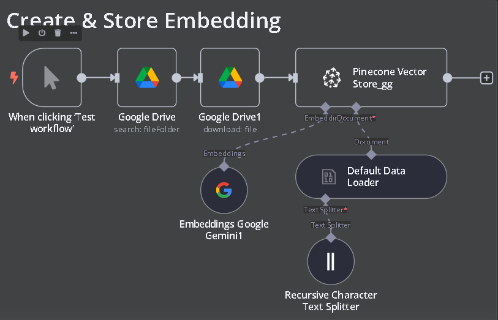
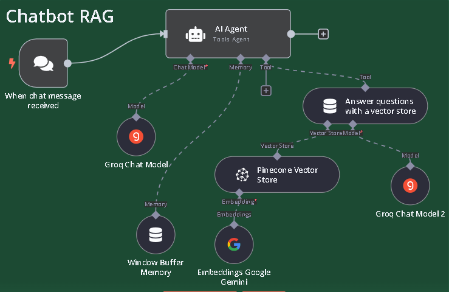

# n8n-Futuristic
AI-Agent: Low-Code &amp; No-Code Automation Nexus

<div align="center">
<!-- width=120 height=120 -->


 🌎 English / [Vietnamese](README_vn.md) / [日本](README_jp.md)

</div>
<br>

# Introduction
 <!-- chèn ảnh vô -->
[n8n](https://github.com/n8n-io/n8n) is a next-gen, future-proof no-code platform that merges coding flexibility with rapid integrations, built-in AI, and complete data control.
# Chatbot RAG

*Chat* and *Embedding* models are combined to build chatbots based on personal data, implemented in a no-code/low-code approach to minimize programming and no payment *API* costs.

<div align="center">
<!-- width=120 height=120 -->
 Vector store Embedding


 Pipeline Chatbot


</div>

# Technical Overview
- Google Gemini Embedding
- Groq 
- Pinecone Vector Store
- Google Cloud
# Demonstration


- Watch full video [Here](https://youtu.be/wPphLabVUJU) how to build chatbot with your own data without payment API, 
- Or read documents: [Read](docs/README_docs.md) 


# Quick Start
Try n8n instantly with [npx](https://docs.n8n.io/hosting/installation/npm/) (requires [Node.js](https://nodejs.org/en/)):

```
cd n8n
npx n8n
```

Or deploy with [Docker](https://docs.n8n.io/hosting/installation/docker/):

```
docker volume create n8n_data
docker run -it --rm --name n8n -p 5678:5678 -v n8n_data:/home/node/.n8n docker.n8n.io/n8nio/n8n
```

Access the editor at http://localhost:5678

Or using web editor for low-code/no-code : [Get Started](https://n8n.io/)


# Resources
- 📚 [Documentation](https://docs.n8n.io)
- 🔧 [400+ Integrations](https://n8n.io/integrations)
- 💡 [Example Workflows](https://n8n.io/workflows)
- 🤖 [AI & LangChain Guide](https://docs.n8n.io/langchain/)
- 👥 [Community Forum](https://community.n8n.io)
- 📖 [Community Tutorials](https://community.n8n.io/c/tutorials/28)
## What does n8n mean?

**Short answer:** It means "nodemation" and is pronounced as n-eight-n.

**Long answer:** "I get that question quite often (more often than I expected) so I decided it is probably best to answer it here. While looking for a good name for the project with a free domain I realized very quickly that all the good ones I could think of were already taken. So, in the end, I chose nodemation. 'node-' in the sense that it uses a Node-View and that it uses Node.js and '-mation' for 'automation' which is what the project is supposed to help with. However, I did not like how long the name was and I could not imagine writing something that long every time in the CLI. That is when I then ended up on 'n8n'." - **Jan Oberhauser, Founder and CEO, n8n.io**