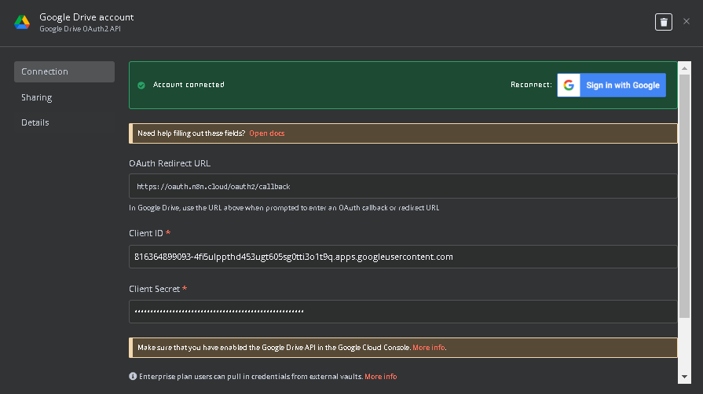

# Step 1: You need to have a account Google Cloud: [Get Started](https://console.cloud.google.com/welcome?inv=1&invt=AbqUhQ&project=n8n-rag-451315)
- Make sure that [*Enable*](https://console.cloud.google.com/marketplace/product/google/drive.googleapis.com?q=search&referrer=search&inv=1&invt=AbqUXw&project=n8n-rag-451315) the Google Drive API in Cloud
- Create new project and get your *Client ID* and *Clinet Secret* from cloud => put them in n8n

# Step 2: Pinecone vector store
